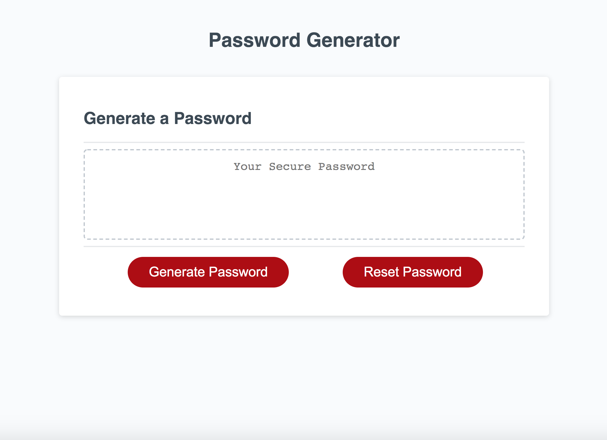

# Random Password Generator

## Purpose
A website that generates a random secure password for the user.  Pertinent features include:
* Option for user to pick number of characters
* Option to include character types (symbols, numbers, uppercase letters and lowercase letters)
* Generate password button
* Reset password function

This is a basic landing page with fucntions under the hood to create the password, console log the process and outcome, and display generated random password on screen.

## Built With
* HTML
* CSS
* JavaScript

## Website
https://taylornyquist.github.io/password-generator/

## Screen Shots

 

 ## Responsiveness
* Media queries optimized for max width of 500px
* Flex boxes used throughout

### Contribution
Made with ❤️ by Taylor Nyquist